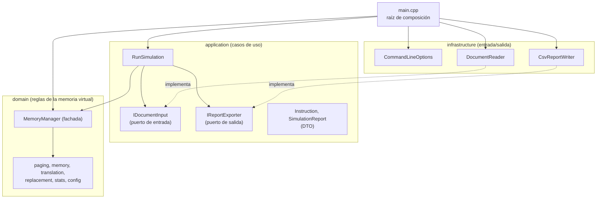

# Diseño del simulador

Este documento explica cómo está organizado el código, qué decisiones se
tomaron y por qué, y qué principios y patrones de diseño se aplicaron.

## 1. Arquitectura por capas

El proyecto sigue Clean Architecture, en su variante Ports & Adapters. Hay
tres capas, y cada una solo depende de las que están más adentro. Por fuera de
ellas está `main.cpp`, la raíz de composición, que conoce todas las capas para
poder conectarlas.



Versión en texto:

```text
┌───────────────────────────────────────────────────────────┐
│ main.cpp: raíz de composición (crea y conecta todo)       │
└─────────────────────────┬─────────────────────────────────┘
                          │ conoce todas las capas
┌─────────────────────────▼─────────────────────────────────┐
│ infrastructure: CommandLineOptions, DocumentReader,       │
│                 CsvReportWriter                           │
└─────────────────────────┬─────────────────────────────────┘
                          │ depende de (e implementa sus puertos)
┌─────────────────────────▼─────────────────────────────────┐
│ application: RunSimulation, IDocumentInput,               │
│              IReportExporter, Instruction,                │
│              SimulationReport                             │
└─────────────────────────┬─────────────────────────────────┘
                          │ depende de
┌─────────────────────────▼─────────────────────────────────┐
│ domain: MemoryManager, tablas de páginas, TLB, marcos,    │
│         memoria física, políticas de reemplazo,           │
│         estadísticas (solo biblioteca estándar, sin I/O)  │
└───────────────────────────────────────────────────────────┘
```

### Regla de dependencia

Ningún archivo de `domain/` incluye algo de `application/` o
`infrastructure/`, y ningún archivo de `application/` incluye algo de
`infrastructure/`.

Las interfaces `IDocumentInput` e `IReportExporter` están en la capa de
aplicación, y son las clases de infraestructura las que las implementan. Así,
la flecha de dependencia apunta hacia adentro aunque, al ejecutarse, la
aplicación llame a la infraestructura.

### Independencia de librerías externas

El dominio solo usa la biblioteca estándar de C++ (`vector`, `queue`,
`unordered_set`, `optional`, `unique_ptr`, excepciones estándar). No lee
archivos, no escribe en consola y no conoce el formato CSV: la lectura de la
entrada (`fstream`) y la escritura del reporte están solo en
`infrastructure/`.

### Organización por carpetas

```text
include/ y src/
├── main.cpp                     raíz de composición (solo en src/)
├── domain/
│   ├── MemoryManager            fachada: allocate, read, write, free
│   ├── config/
│   │   └── MemoryConfig         parámetros validados y valores derivados
│   ├── paging/
│   │   ├── VirtualAddress       descompone una VA en índice L1, índice L2, offset y VPN
│   │   ├── DirectoryTable       nivel 1: entradas y tablas de nivel 2 creadas bajo demanda
│   │   ├── DirectoryTableEntry  número de tabla y bit válido
│   │   ├── PageTable            nivel 2: vector de PTE
│   │   ├── PageTableEntry       pfn, valid, accessed, dirty, allocated
│   │   └── VirtualAllocator     reserva páginas (alloc)
│   ├── memory/
│   │   ├── PhysicalMemory       contenido de la RAM (vector de bytes)
│   │   ├── FrameTable           información de cada marco y cola de marcos libres
│   │   └── TLB                  caché de traducciones VPN → marco
│   ├── translation/
│   │   ├── AddressTranslator    traducción VA → PA (TLB y recorrido de tablas)
│   │   └── PageFaultHandler     consigue un marco y carga la página
│   ├── replacement/
│   │   ├── IReplacementPolicy   interfaz de las políticas
│   │   ├── FifoPolicy           política de los marcos físicos
│   │   └── LRUPolicy            política de la TLB
│   └── stats/
│       ├── Stats                accesos, fallos, reemplazos y hits de TLB
│       └── Tick                 reloj lógico
├── application/
│   ├── RunSimulation            caso de uso: ejecuta las instrucciones
│   ├── Instruction              DTO de entrada
│   ├── SimulationReport         DTO de salida
│   └── ports/
│       ├── IDocumentInput       puerto de entrada
│       └── IReportExporter      puerto de salida
└── infrastructure/
    ├── CommandLineOptions       lee y valida los argumentos
    ├── DocumentReader           implementa IDocumentInput (archivo de texto)
    └── CsvReportWriter          implementa IReportExporter (archivo CSV)
```

## 2. Flujo de una ejecución

1. **Arranque.** `main` convierte los argumentos en un `CommandLineOptions`
   (archivo de entrada, tamaño de página, memoria física y ruta del CSV).
2. **Construcción.** `main` crea `MemoryConfig`, el `MemoryManager` con una
   `FifoPolicy`, el `DocumentReader` y el `CsvReportWriter`, y los inyecta en
   `RunSimulation`. El `MemoryManager` construye y conecta las piezas internas
   del dominio.
3. **Lectura.** `RunSimulation` pide las instrucciones a `IDocumentInput`. El
   `DocumentReader` lee el archivo, lo separa en tokens y los convierte en
   `Instruction`. Un error de sintaxis detiene todo antes de simular.
4. **Ejecución.** Cada instrucción se ejecuta sobre el `MemoryManager`. Un
   error de ejecución (por ejemplo, un segmentation fault) se registra y la
   simulación continúa con la siguiente.
5. **Reporte.** `RunSimulation` arma un `SimulationReport` con las
   estadísticas y lo entrega a `IReportExporter`. El `CsvReportWriter` agrega
   una fila al CSV.

### Flujo de un `read` o `write`

1. `VirtualAddress` descompone la dirección.
2. `AddressTranslator` consulta la TLB. Si la traducción está, termina.
3. Si no, recorre el directorio y la tabla de nivel 2:
   - si no hay tabla o la PTE no tiene `allocated`, lanza un segmentation fault;
   - si la página está reservada pero no es válida, reporta un fallo de página;
   - si es válida, guarda la traducción en la TLB y termina.
4. Ante un fallo de página, `PageFaultHandler` usa un marco libre o, si no
   hay, pide una víctima a la política, invalida su PTE y su entrada en la
   TLB, limpia el marco y carga la página nueva.
5. `MemoryManager` marca `accessed` (y `dirty` si es escritura), avisa a la
   política, actualiza estadísticas y reloj, y lee o escribe el byte en
   `PhysicalMemory`.

## 3. Decisiones de diseño

| Decisión | Motivo |
|---|---|
| Los bits de la dirección se derivan del tamaño de página. Si los bits del VPN son impares, el bit extra va al nivel 1. | El tamaño de página es configurable, así que la división 10/10/12 no puede estar fija. Las tablas de nivel 2 se crean bajo demanda y pueden ser muchas; conviene que sean las más pequeñas. |
| La memoria guarda bytes (0 a 255). | Cada dirección es exactamente una celda, como en una memoria real direccionable por byte. El parser rechaza valores mayores con un mensaje claro. |
| `alloc` reserva páginas completas, de forma consecutiva desde la dirección 0, y no reutiliza direcciones. | Coincide con el ejemplo del enunciado (`write 0`, `write 4096`). Con 4 GB de espacio virtual no hace falta reutilizar. |
| Las tablas de nivel 2 se crean al reservar, no al acceder. | Un acceso a memoria nunca reservada debe dar error, no crear tablas vacías. |
| Acceder a memoria no reservada es un segmentation fault; a memoria reservada pero no cargada, un fallo de página. | Distingue un error del programa de un evento normal de la memoria virtual. El bit `allocated` de la PTE hace posible la distinción. |
| Un segmentation fault se registra en el reporte y la simulación continúa. Un error de sintaxis en la entrada detiene todo antes de empezar. | Un archivo mal escrito es un error de quien lo escribió y conviene detectarlo antes de simular. Un segmentation fault es parte del comportamiento que el simulador modela. |
| Los marcos se llenan con ceros antes de entregarlos a una página nueva. | Sin esto, una página leía los datos de la víctima anterior. Los sistemas operativos reales hacen lo mismo para no filtrar información entre procesos. |
| No hay swap: una página expulsada pierde su contenido y al recargarse vuelve en ceros. | Simplificación del laboratorio. El bit `dirty` se mantiene para mostrar qué páginas habrían requerido escritura a disco. |
| Los accesos que terminan en segmentation fault no cuentan en las estadísticas ni en el reloj. | Solo los accesos válidos forman parte del hit rate. |
| El tiempo se mide con un reloj lógico (`Tick`): un tick por acceso válido. | Es determinista: la misma entrada da el mismo resultado en cualquier computador. Con un tick por acceso, el total coincide con el número de accesos; si se quisiera un modelo de costos (más ticks por un fallo de página), solo cambia dónde avanza el reloj. |
| La TLB tiene 16 entradas y usa `LRUPolicy` para elegir qué entrada reemplazar. | Una TLB pequeña es realista, y LRU aprovecha la localidad de los accesos. Sus hits se reportan aparte y no cambian el hit rate de páginas, que el enunciado define en términos de fallos de página. |
| Los marcos físicos usan `FifoPolicy`, implementada con `std::queue`. | FIFO es la política asignada. Para `free`, que debe quitar un marco del medio, se da una vuelta completa a la cola conservando el orden de los demás; es O(n), pero `free` es poco frecuente y la cola nunca supera la cantidad de marcos. Un `unordered_set` acompaña a la cola para validar cargas y liberaciones sin recorrerla. |
| Las tablas de páginas viven fuera de la memoria física simulada. | Simplificación: todos los marcos quedan disponibles para páginas de datos, lo que hace más claros los resultados de reemplazo. |
| Una PTE solo cambia a través de operaciones con significado (`allocate`, `load`, `recordAccess`, `invalidate`). | Así nunca queda en un estado inválido, como `valid = true` sin `allocated`. |
| El PFN de la PTE y la VPN dueña de un marco se guardan como números, no como punteros. | Los marcos existen desde el inicio en un contenedor fijo, así que basta un índice. Las tablas de nivel 2, que se crean bajo demanda, sí se guardan con `unique_ptr`. |
| El reporte se escribe en CSV (por defecto `docs/reporte.csv`), agregando una fila por ejecución. | Permite comparar corridas con distintas configuraciones en un mismo archivo. El encabezado se escribe solo si el archivo no existe o está vacío. |

## 4. Principios de diseño

### SRP: responsabilidad única

Cada clase tiene un solo motivo para cambiar:

- `AddressTranslator` solo traduce; ante un fallo de página no lo resuelve,
  solo lo reporta.
- `PageFaultHandler` solo consigue un marco y carga la página. No actualiza
  estadísticas: devuelve un `PageFaultResult` y `MemoryManager` decide qué
  contar.
- `VirtualAllocator` solo maneja el espacio de direcciones.
- `FrameTable` guarda información sobre los marcos; `PhysicalMemory`, su
  contenido.
- `CommandLineOptions` interpreta los argumentos, `DocumentReader` interpreta
  el archivo y `CsvReportWriter` escribe el reporte.
- `DocumentReader` separa la lectura del archivo (`readInstructions`) del
  análisis del texto (`parse`), lo que permite probar el análisis sin archivos.

### OCP: abierto a extensión, cerrado a modificación

- **Políticas de reemplazo.** `LRUPolicy` se agregó y se usa en la TLB sin
  modificar la interfaz `IReplacementPolicy` ni el código que ya usaba
  `FifoPolicy`. Usar LRU para los marcos físicos sería cambiar una línea en
  `main`; `MemoryManager`, `PageFaultHandler` y `RunSimulation` no cambian.
- **Formatos de entrada y salida.** Un nuevo formato (por ejemplo, un reporte
  en Markdown o JSON) es un adaptador nuevo que implementa `IReportExporter` o
  `IDocumentInput`. `RunSimulation` no cambia.

La interfaz `IReplacementPolicy` tiene un evento por cada momento del ciclo de
vida de un marco: `onLoad`, `onAccess`, `onFree` y `selectVictim`. FIFO ignora
`onAccess`, pero el evento está en la interfaz porque LRU lo necesita. Esto no
rompe ISP: el cliente de la interfaz (`MemoryManager`, y la `TLB`) usa todos
los métodos. Mantenerlo como método puro obliga a cada política nueva a
decidir explícitamente qué hacer con él.

### DIP: inversión de dependencias

- `RunSimulation` depende de `IDocumentInput` e `IReportExporter`, no de
  `DocumentReader` ni de `CsvReportWriter`. Por eso sus pruebas usan
  implementaciones falsas de los puertos, sin archivos.
- `MemoryManager` y `PageFaultHandler` dependen de `IReplacementPolicy`, no de
  `FifoPolicy`.
- Las interfaces de los puertos pertenecen a la capa de aplicación, y la
  infraestructura las implementa: el detalle depende de la abstracción.

La inyección de dependencias por constructor es la técnica que hace posible
DIP en el proyecto. `main.cpp` es el único lugar que conoce las clases
concretas: crea cada pieza y la entrega a quien la necesita. Dentro del
dominio, `MemoryManager` hace lo mismo con sus piezas internas, por ejemplo
entregando la política a `PageFaultHandler` como `IReplacementPolicy&`.

### Encapsulamiento

- Todos los atributos son privados.
- `MemoryConfig` valida sus parámetros en el constructor y después es
  inmutable; los valores derivados no se pueden cambiar desde afuera.
- `VirtualAddress` es inmutable y no guarda la configuración, así que se
  puede copiar libremente.
- `PageTableEntry` no tiene setters: solo operaciones que mantienen su estado
  coherente.
- `DirectoryTable` guarda sus tablas de nivel 2 en un vector privado de
  `unique_ptr`; desde afuera solo se accede a ellas por índice, y cada índice
  se valida.
- `MemoryManager` no se puede copiar ni mover (`= delete`), porque sus
  atributos se referencian entre sí y una copia quedaría apuntando a los del
  original.

## 5. Patrones de diseño

| Patrón | Dónde | Por qué |
|---|---|---|
| **Strategy** | `IReplacementPolicy`, `FifoPolicy`, `LRUPolicy` | El algoritmo de reemplazo se puede cambiar sin tocar el código que lo usa. La misma interfaz se usa en dos lugares: `FifoPolicy` para los marcos físicos y `LRUPolicy` para las entradas de la TLB. |
| **Facade** | `MemoryManager` | Ofrece cuatro operaciones (`allocate`, `read`, `write`, `free`) y oculta la coordinación entre traductor, TLB, tablas, marcos, política, estadísticas y reloj. |
| **Ports & Adapters** | `IDocumentInput` / `DocumentReader`, `IReportExporter` / `CsvReportWriter` | El caso de uso no depende de archivos ni de formatos; cada adaptador traduce entre el mundo exterior y la aplicación. |
| **DTO** | `Instruction`, `SimulationReport`, `CommandLineOptions`, `TranslationResult`, `PageFaultResult` | Estructuras simples para mover datos entre capas o componentes, sin lógica. |
| **Value Object** | `VirtualAddress`, `MemoryConfig` | Se construyen una vez, se validan al construirse y no cambian. |
| **Composition Root / Inyección de dependencias** | `main.cpp` | Es el único lugar que conoce las clases concretas; crea cada pieza y la inyecta en las demás. |
